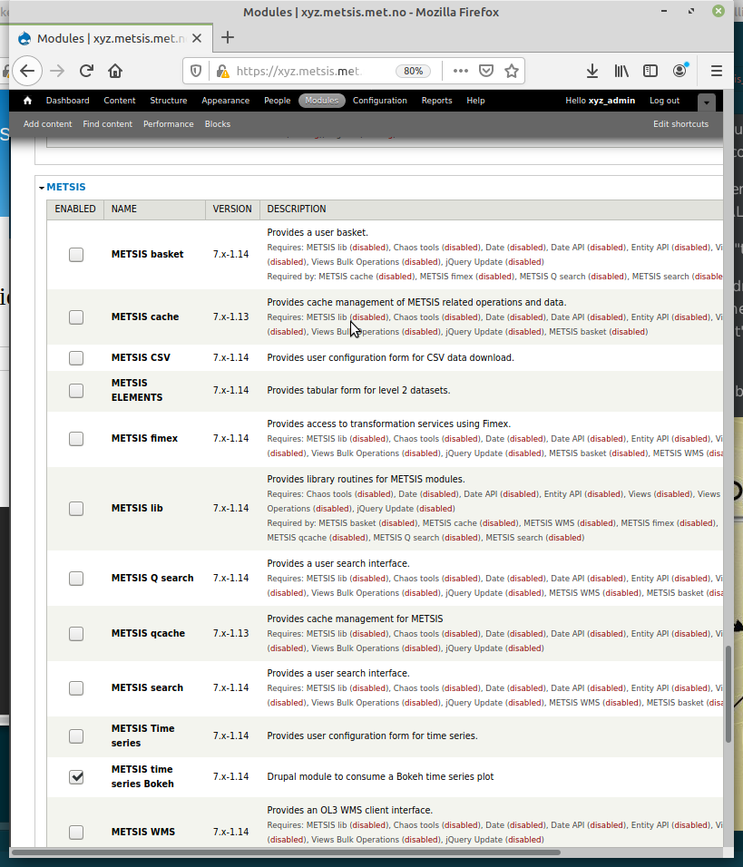
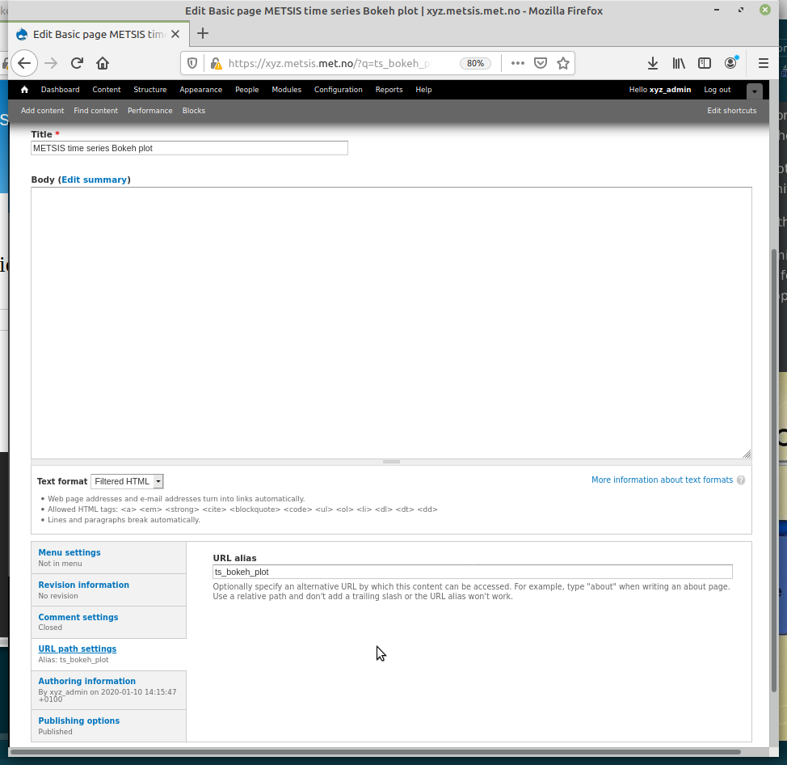
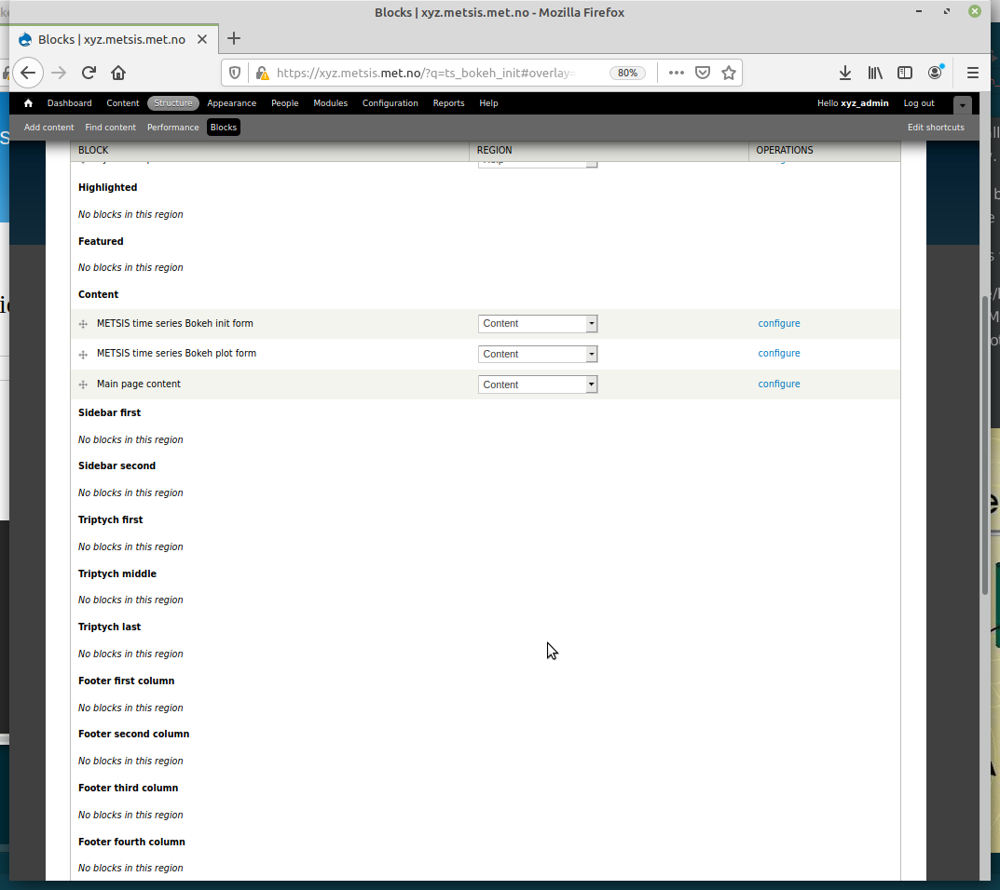
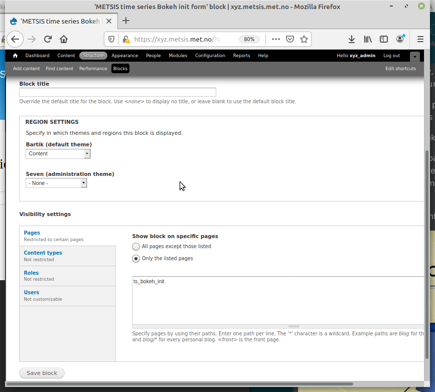
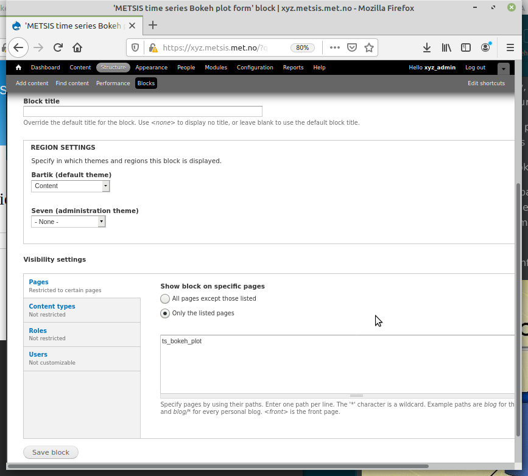

# METSIS time series Bokeh
Drupal machine name: metsis_ts_bokeh

This METSIS module provides blocks for configuring and displaying
a time series plot using the JS Bokeh library. The Bokeh plot is
fetched from an external web service.

## Getting started

Download the metsis_ts_bokeh directory tree either by cloning from git or downloading
a zip archive from git. Place the unpacked directory tree in your running Drupal's custom
modules directory and follow the installation instructions below.

### Prerequisites

A running instance of Drupal 7.69.

Administrative access to the Drupal instance.

### Installing

1. Login as admin into your Drupal 7 site

2. Go the modules admin page (?q=admin/modules). There should be an entry
"METSIS time series Bokeh" under the "METSIS" section of the modules.

3. Enable this module. You may, depending on your installation, get some warnings
about the module not being configured. Ignore these for now. We will fix them
in the next steps.

4. Create a basic Drupal empty page. Title not important but under "
URL path settings" for the page give it the URL alias "ts_bokeh_init". Save the page.

5. Repeat the previous step, but use "ts_bokeh_plot" as the URL alias for the page and save it.

6. Now go to the blocks admin page (?q=admin/structure/block) where you should
find the two blocks "METSIS time series Bokeh init form" and "METSIS time series
Bokeh plot form". Choose "Content" from REGION dropdown for both and "Save blocks"
(bottom of the page)

7. Now each block has to be configured to appear on the appropriate page (pages from steps 4 and 5)

8. Save the configuration and clear all Drupal caches (configuration->performance).

### Testing

1. Now you can type the URL of the METSIS time series bokeh init page in your
browser `<your site URL>/?q=ts_bokeh_init ` which should resemble

Type in the URL of the service that provides the Bokeh plot and submit the form.

2. Drupal has not fetched the available variables for plotting and presents these in
the plot configuration form

Currently Bokeh plot service limits the X-axis to displaying time. Choose the variable
you wish to plot on the Y-axis and submit the form. Your time series Bokeh plot should now
be visible.

### *Note on Drupal 8*
*This module is developed and tested on Drupal 7.69.*

*There are major differences between Drupal 7 and 8 and while this module may work fine
on a Drupal 8 site, there are no guarantees that it will.*

